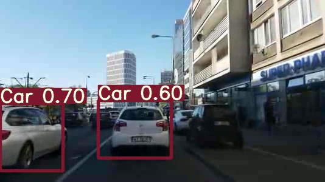

## SMART TRACK
>Notebook is a kind of (short) journey in pursuit of finding a way to separate instances and track them from a given video file.
Two architectures were compared VGG16 and YOLO5.
Result is output video file with bounding boxes embeded( example frame below) and text file/files containg bounding boxes coordinates 
for given video frame.

```
'frame_nr','filename', 'class', 'left_x', 'top_y', 'width', 'height'
!head -n 5 /content/yolov5/cars.csv
frame_nr,filename,class,left_x,top_y,width,height
22,0002-20170519-2_22.mp4,2,0.802434,0.698333,0.338951,0.37
23,0002-20170519-2_23.mp4,2,0.80618,0.698333,0.342697,0.37
24,0002-20170519-2_24.mp4,2,0.807116,0.698333,0.344569,0.37
25,0002-20170519-2_25.mp4,2,0.809925,0.701667,0.338951,0.37

```




#### _frame from the video registered by car camera processed by YOLOv5s_
---


## Libraries
[YOLOv5 repository](https://github.com/ultralytics/yolov5) by [Ultralytics](https://www.ultralytics.com/) as well as 
[Roboflow YOLOv5](https://blog.roboflow.ai/how-to-train-yolov5-on-a-custom-dataset/). 

Pictures for training taken from:
[Google repository Open Image Dataset V4(now6)](https://storage.googleapis.com/openimages/web/index.html)

Downloaded and preprocessed using:
[OIDv4_ToolKit](https://github.com/EscVM/OIDv4_ToolKit)

Other:

* [torch](https://pytorch.org/)
* [ipywidgets](https://ipywidgets.readthedocs.io/en/stable/)
* [Keras](https://keras.io/)
* [OpenCV](https://opencv.org/)


---


## Status
Project is: _in progress_, 


### Info
Created by [@len-sla]